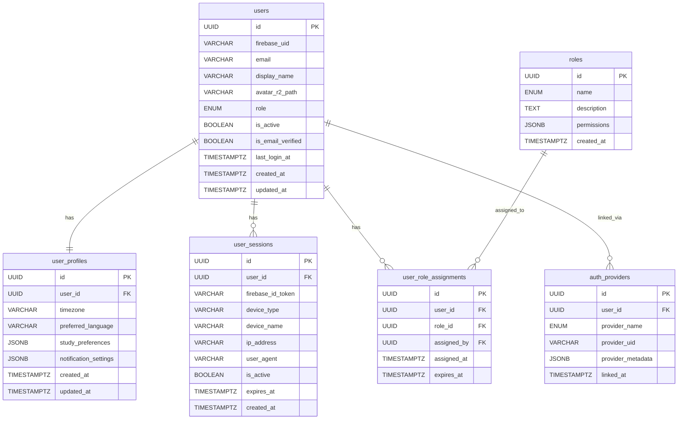
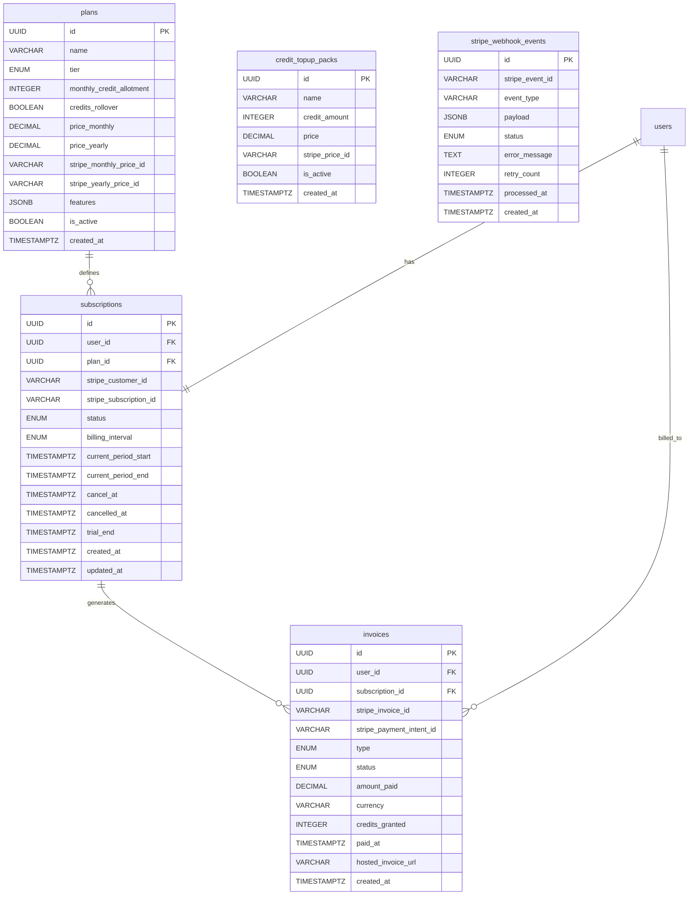
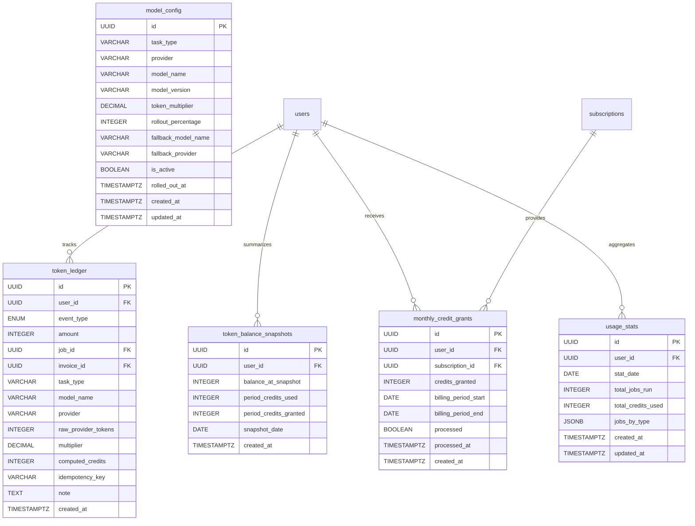
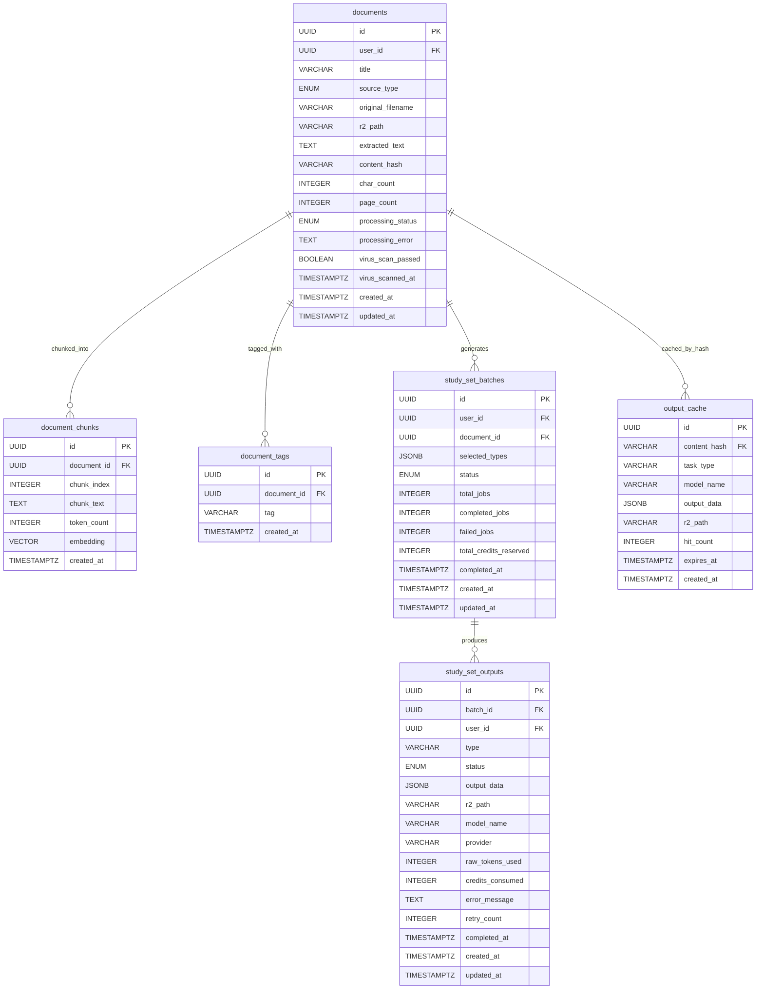
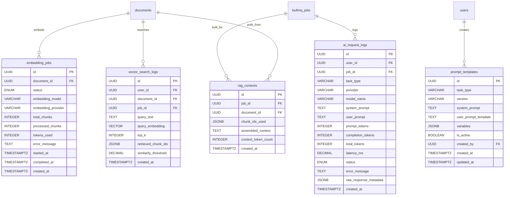
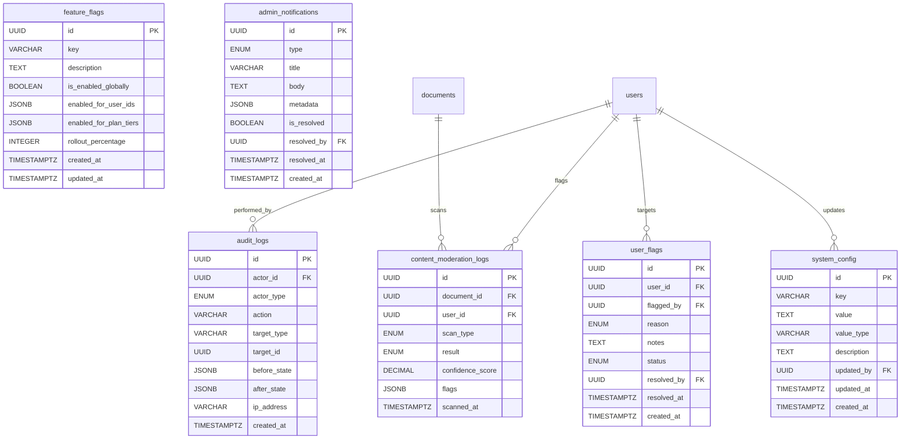
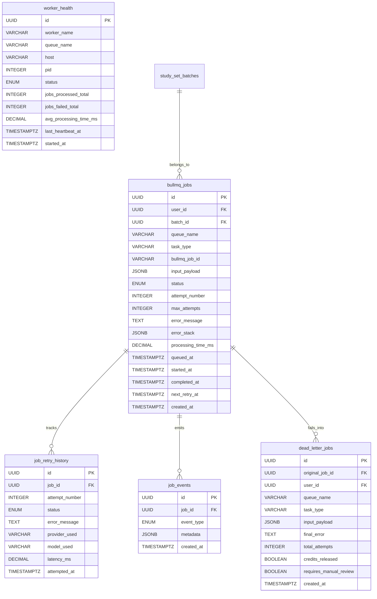
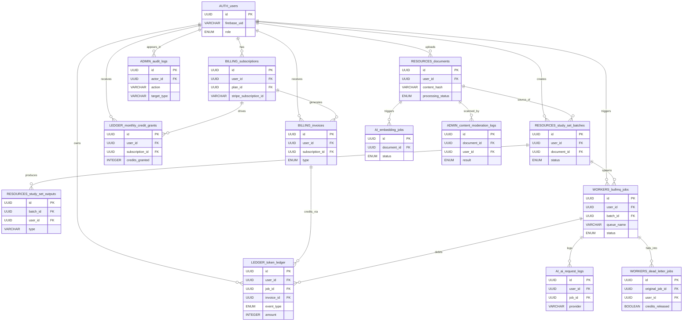

# Data Management Approach

Epics: Design Data Architecture (../Dwh%20Project/Design%20Data%20Architecture%20adb379c3555d828185a1010301cc3cd5.md)
Status: Yes

---

# Full Database Schema Design

## Group 1: Authentication & User Management

---

## Group 2: Payment & Billing

This group covers Stripe integration, subscription lifecycle, plan definitions, and invoice history.

---

## Group 3: Usage & Token Ledger

This group is append-only. No rows are ever updated or deleted. The balance is always computed from the sum.

---

## Group 4: Resources (Documents & Content)

This covers everything a student uploads or pastes, and how it is stored, chunked, and referenced.

---

## Group 5: AI & RAG Architecture

This group covers the vector search, embedding jobs, and prompt/response logging.

---

## Group 6: Administration

This covers admin actions, moderation, system configuration, and feature flags.

---

## Group 7: Workers & Job Management

This covers BullMQ job state tracking, retry history, and worker health monitoring.

---

## Group Interconnection Diagram

This final diagram shows how each group connects to the others. It intentionally shows only the foreign key relationships between groups — not the internal structure of each table.

---