# Design the workflows

Epics: Design Data Architecture (../Dwh%20Project/Design%20Data%20Architecture%20adb379c3555d828185a1010301cc3cd5.md)
Status: Yes

# Complete Flow Diagrams

All flows are written from my system's perspective — describing what each component does internally.

---

## Group 1: Authentication Flows

### 1.1 — New user registration

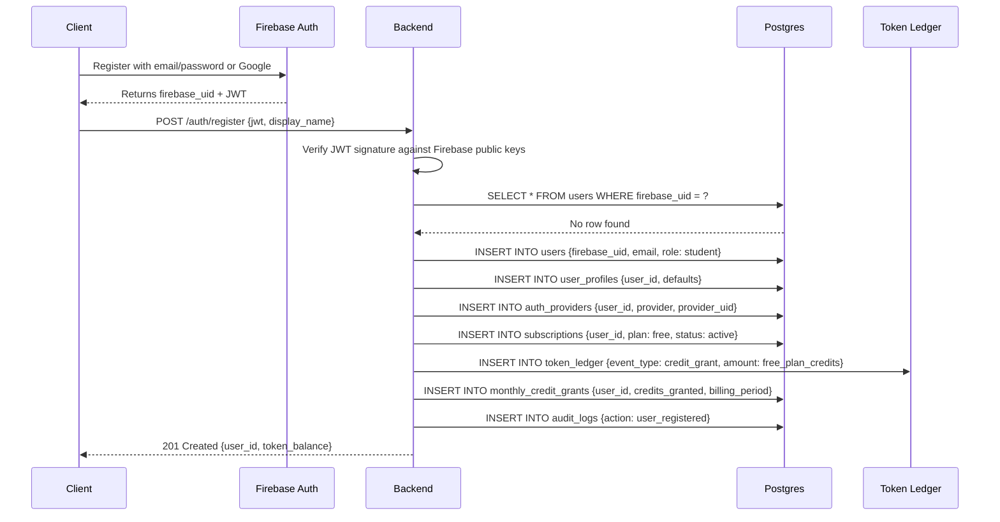
```mermaid
sequenceDiagram
    participant Client
    participant FirebaseAuth as Firebase Auth
    participant Backend
    participant Postgres
    participant Ledger as Token Ledger

    Client->>FirebaseAuth: Register with email/password or Google
    FirebaseAuth-->>Client: Returns firebase_uid + JWT

    Client->>Backend: POST /auth/register {jwt, display_name}
    Backend->>Backend: Verify JWT signature against Firebase public keys
    Backend->>Postgres: SELECT * FROM users WHERE firebase_uid = ?
    Postgres-->>Backend: No row found

    Backend->>Postgres: INSERT INTO users {firebase_uid, email, role: student}
    Backend->>Postgres: INSERT INTO user_profiles {user_id, defaults}
    Backend->>Postgres: INSERT INTO auth_providers {user_id, provider, provider_uid}

    Backend->>Postgres: INSERT INTO subscriptions {user_id, plan: free, status: active}
    Backend->>Ledger: INSERT INTO token_ledger {event_type: credit_grant, amount: free_plan_credits}
    Backend->>Postgres: INSERT INTO monthly_credit_grants {user_id, credits_granted, billing_period}

    Backend->>Postgres: INSERT INTO audit_logs {action: user_registered}
    Backend-->>Client: 201 Created {user_id, token_balance}
```

---

### 1.2 — Returning user login

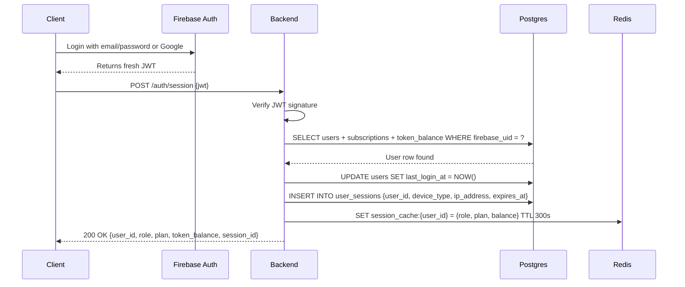
```mermaid
sequenceDiagram
    participant Client
    participant FirebaseAuth as Firebase Auth
    participant Backend
    participant Postgres
    participant Redis

    Client->>FirebaseAuth: Login with email/password or Google
    FirebaseAuth-->>Client: Returns fresh JWT

    Client->>Backend: POST /auth/session {jwt}
    Backend->>Backend: Verify JWT signature
    Backend->>Postgres: SELECT users + subscriptions + token_balance WHERE firebase_uid = ?
    Postgres-->>Backend: User row found

    Backend->>Postgres: UPDATE users SET last_login_at = NOW()
    Backend->>Postgres: INSERT INTO user_sessions {user_id, device_type, ip_address, expires_at}
    Backend->>Redis: SET session_cache:{user_id} = {role, plan, balance} TTL 300s

    Backend-->>Client: 200 OK {user_id, role, plan, token_balance, session_id}
```

---

### 1.3 — JWT middleware validation on every request

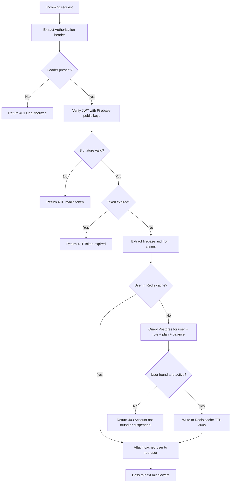
```mermaid
flowchart TD
    A[Incoming request] --> B[Extract Authorization header]
    B --> C{Header present?}
    C -- No --> D[Return 401 Unauthorized]
    C -- Yes --> E[Verify JWT with Firebase public keys]
    E --> F{Signature valid?}
    F -- No --> G[Return 401 Invalid token]
    F -- Yes --> H{Token expired?}
    H -- Yes --> I[Return 401 Token expired]
    H -- No --> J[Extract firebase_uid from claims]
    J --> K{User in Redis cache?}
    K -- Yes --> L[Attach cached user to req.user]
    K -- No --> M[Query Postgres for user + role + plan + balance]
    M --> N{User found and active?}
    N -- No --> O[Return 403 Account not found or suspended]
    N -- Yes --> P[Write to Redis cache TTL 300s]
    P --> L
    L --> Q[Pass to next middleware]
```

---

## Group 2: Upload & Content Processing Flows

### 2.1 — PDF upload pipeline

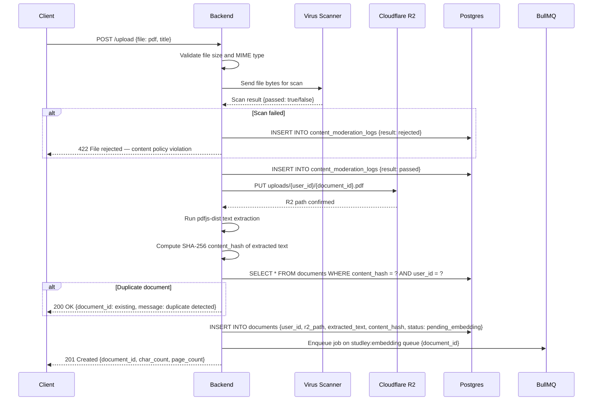
```mermaid
sequenceDiagram
    participant Client
    participant Backend
    participant VirusScan as Virus Scanner
    participant R2 as Cloudflare R2
    participant Postgres
    participant BullMQ

    Client->>Backend: POST /upload {file: pdf, title}
    Backend->>Backend: Validate file size and MIME type
    Backend->>VirusScan: Send file bytes for scan
    VirusScan-->>Backend: Scan result {passed: true/false}

    alt Scan failed
        Backend->>Postgres: INSERT INTO content_moderation_logs {result: rejected}
        Backend-->>Client: 422 File rejected — content policy violation
    end

    Backend->>Postgres: INSERT INTO content_moderation_logs {result: passed}
    Backend->>R2: PUT uploads/{user_id}/{document_id}.pdf
    R2-->>Backend: R2 path confirmed

    Backend->>Backend: Run pdfjs-dist text extraction
    Backend->>Backend: Compute SHA-256 content_hash of extracted text
    Backend->>Postgres: SELECT * FROM documents WHERE content_hash = ? AND user_id = ?

    alt Duplicate document
        Backend-->>Client: 200 OK {document_id: existing, message: duplicate detected}
    end

    Backend->>Postgres: INSERT INTO documents {user_id, r2_path, extracted_text, content_hash, status: pending_embedding}
    Backend->>BullMQ: Enqueue job on studley:embedding queue {document_id}
    Backend-->>Client: 201 Created {document_id, char_count, page_count}
```

---

### 2.2 — Plain text input pipeline

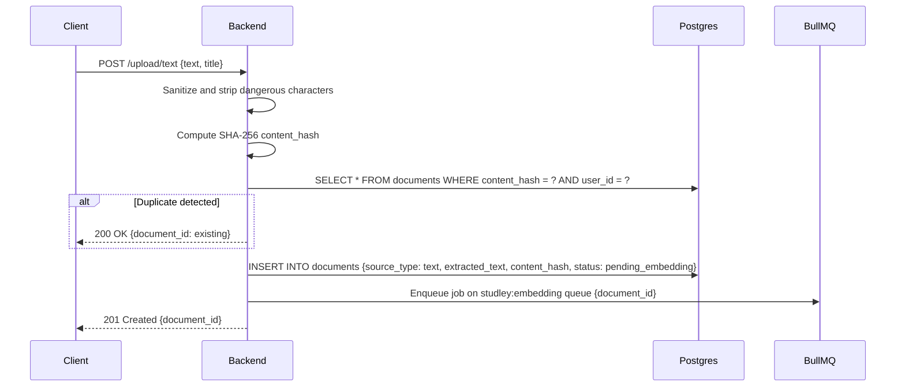
```mermaid
sequenceDiagram
    participant Client
    participant Backend
    participant Postgres
    participant BullMQ

    Client->>Backend: POST /upload/text {text, title}
    Backend->>Backend: Sanitize and strip dangerous characters
    Backend->>Backend: Compute SHA-256 content_hash
    Backend->>Postgres: SELECT * FROM documents WHERE content_hash = ? AND user_id = ?

    alt Duplicate detected
        Backend-->>Client: 200 OK {document_id: existing}
    end

    Backend->>Postgres: INSERT INTO documents {source_type: text, extracted_text, content_hash, status: pending_embedding}
    Backend->>BullMQ: Enqueue job on studley:embedding queue {document_id}
    Backend-->>Client: 201 Created {document_id}
```

---

### 2.3 — Embedding & chunking worker

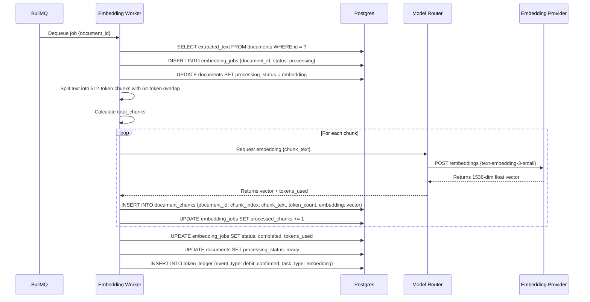
```mermaid
sequenceDiagram
    participant BullMQ
    participant EmbedWorker as Embedding Worker
    participant Postgres
    participant ModelRouter as Model Router
    participant OpenAI as Embedding Provider

    BullMQ->>EmbedWorker: Dequeue job {document_id}
    EmbedWorker->>Postgres: SELECT extracted_text FROM documents WHERE id = ?
    EmbedWorker->>Postgres: INSERT INTO embedding_jobs {document_id, status: processing}
    EmbedWorker->>Postgres: UPDATE documents SET processing_status = embedding

    EmbedWorker->>EmbedWorker: Split text into 512-token chunks with 64-token overlap
    EmbedWorker->>EmbedWorker: Calculate total_chunks

    loop For each chunk
        EmbedWorker->>ModelRouter: Request embedding {chunk_text}
        ModelRouter->>OpenAI: POST /embeddings {text-embedding-3-small}
        OpenAI-->>ModelRouter: Returns 1536-dim float vector
        ModelRouter-->>EmbedWorker: Returns vector + tokens_used
        EmbedWorker->>Postgres: INSERT INTO document_chunks {document_id, chunk_index, chunk_text, token_count, embedding: vector}
        EmbedWorker->>Postgres: UPDATE embedding_jobs SET processed_chunks += 1
    end

    EmbedWorker->>Postgres: UPDATE embedding_jobs SET status: completed, tokens_used
    EmbedWorker->>Postgres: UPDATE documents SET processing_status: ready
    EmbedWorker->>Postgres: INSERT INTO token_ledger {event_type: debit_confirmed, task_type: embedding}
```

---

## Group 3: Study Set Generation Flows

### 3.1 — Batch creation and job fan-out

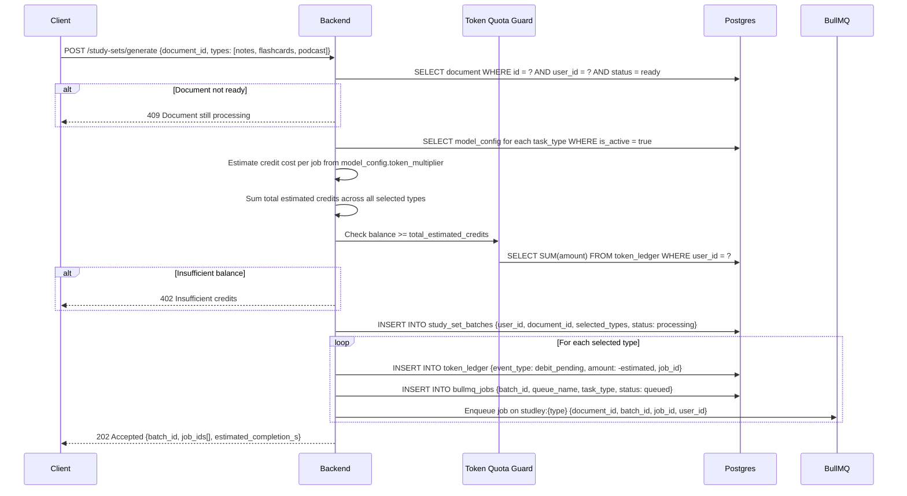
```mermaid
sequenceDiagram
    participant Client
    participant Backend
    participant QuotaGuard as Token Quota Guard
    participant Postgres
    participant BullMQ

    Client->>Backend: POST /study-sets/generate {document_id, types: [notes, flashcards, podcast]}
    Backend->>Postgres: SELECT document WHERE id = ? AND user_id = ? AND status = ready

    alt Document not ready
        Backend-->>Client: 409 Document still processing
    end

    Backend->>Postgres: SELECT model_config for each task_type WHERE is_active = true
    Backend->>Backend: Estimate credit cost per job from model_config.token_multiplier
    Backend->>Backend: Sum total estimated credits across all selected types

    Backend->>QuotaGuard: Check balance >= total_estimated_credits
    QuotaGuard->>Postgres: SELECT SUM(amount) FROM token_ledger WHERE user_id = ?

    alt Insufficient balance
        Backend-->>Client: 402 Insufficient credits
    end

    Backend->>Postgres: INSERT INTO study_set_batches {user_id, document_id, selected_types, status: processing}

    loop For each selected type
        Backend->>Postgres: INSERT INTO token_ledger {event_type: debit_pending, amount: -estimated, job_id}
        Backend->>Postgres: INSERT INTO bullmq_jobs {batch_id, queue_name, task_type, status: queued}
        Backend->>BullMQ: Enqueue job on studley:{type} {document_id, batch_id, job_id, user_id}
    end

    Backend-->>Client: 202 Accepted {batch_id, job_ids[], estimated_completion_s}
```

---

### 3.2 — Generic study set worker flow (notes, MCQ, flashcards, fill-in-blanks, written test, content)

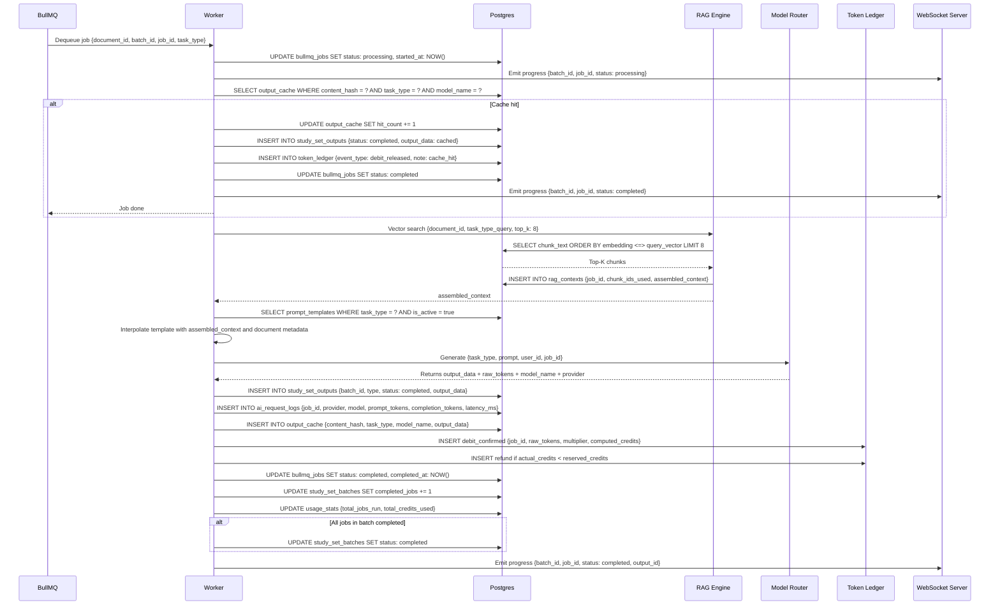
```mermaid
sequenceDiagram
    participant BullMQ
    participant Worker
    participant Postgres
    participant RAGEngine as RAG Engine
    participant ModelRouter as Model Router
    participant Ledger as Token Ledger
    participant WSS as WebSocket Server

    BullMQ->>Worker: Dequeue job {document_id, batch_id, job_id, task_type}
    Worker->>Postgres: UPDATE bullmq_jobs SET status: processing, started_at: NOW()
    Worker->>WSS: Emit progress {batch_id, job_id, status: processing}

    Worker->>Postgres: SELECT output_cache WHERE content_hash = ? AND task_type = ? AND model_name = ?

    alt Cache hit
        Worker->>Postgres: UPDATE output_cache SET hit_count += 1
        Worker->>Postgres: INSERT INTO study_set_outputs {status: completed, output_data: cached}
        Worker->>Postgres: INSERT INTO token_ledger {event_type: debit_released, note: cache_hit}
        Worker->>Postgres: UPDATE bullmq_jobs SET status: completed
        Worker->>WSS: Emit progress {batch_id, job_id, status: completed}
        Worker-->>BullMQ: Job done
    end

    Worker->>RAGEngine: Vector search {document_id, task_type_query, top_k: 8}
    RAGEngine->>Postgres: SELECT chunk_text ORDER BY embedding <=> query_vector LIMIT 8
    Postgres-->>RAGEngine: Top-K chunks
    RAGEngine->>Postgres: INSERT INTO rag_contexts {job_id, chunk_ids_used, assembled_context}
    RAGEngine-->>Worker: assembled_context

    Worker->>Postgres: SELECT prompt_templates WHERE task_type = ? AND is_active = true
    Worker->>Worker: Interpolate template with assembled_context and document metadata

    Worker->>ModelRouter: Generate {task_type, prompt, user_id, job_id}
    ModelRouter-->>Worker: Returns output_data + raw_tokens + model_name + provider

    Worker->>Postgres: INSERT INTO study_set_outputs {batch_id, type, status: completed, output_data}
    Worker->>Postgres: INSERT INTO ai_request_logs {job_id, provider, model, prompt_tokens, completion_tokens, latency_ms}
    Worker->>Postgres: INSERT INTO output_cache {content_hash, task_type, model_name, output_data}

    Worker->>Ledger: INSERT debit_confirmed {job_id, raw_tokens, multiplier, computed_credits}
    Worker->>Ledger: INSERT refund if actual_credits < reserved_credits

    Worker->>Postgres: UPDATE bullmq_jobs SET status: completed, completed_at: NOW()
    Worker->>Postgres: UPDATE study_set_batches SET completed_jobs += 1
    Worker->>Postgres: UPDATE usage_stats {total_jobs_run, total_credits_used}

    alt All jobs in batch completed
        Worker->>Postgres: UPDATE study_set_batches SET status: completed
    end

    Worker->>WSS: Emit progress {batch_id, job_id, status: completed, output_id}
```

---

### 3.3 — Podcast worker (differs due to TTS and R2)

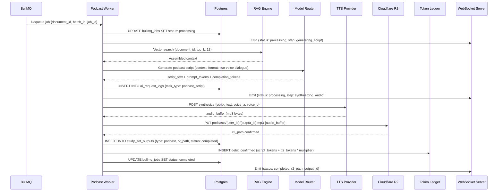
```mermaid
sequenceDiagram
    participant BullMQ
    participant PodcastWorker as Podcast Worker
    participant Postgres
    participant RAGEngine as RAG Engine
    participant ModelRouter as Model Router
    participant TTS as TTS Provider
    participant R2 as Cloudflare R2
    participant Ledger as Token Ledger
    participant WSS as WebSocket Server

    BullMQ->>PodcastWorker: Dequeue job {document_id, batch_id, job_id}
    PodcastWorker->>Postgres: UPDATE bullmq_jobs SET status: processing
    PodcastWorker->>WSS: Emit {status: processing, step: generating_script}

    PodcastWorker->>RAGEngine: Vector search {document_id, top_k: 12}
    RAGEngine-->>PodcastWorker: Assembled context

    PodcastWorker->>ModelRouter: Generate podcast script {context, format: two-voice dialogue}
    ModelRouter-->>PodcastWorker: script_text + prompt_tokens + completion_tokens

    PodcastWorker->>Postgres: INSERT INTO ai_request_logs {task_type: podcast_script}
    PodcastWorker->>WSS: Emit {status: processing, step: synthesizing_audio}

    PodcastWorker->>TTS: POST synthesize {script_text, voice_a, voice_b}
    TTS-->>PodcastWorker: audio_buffer (mp3 bytes)

    PodcastWorker->>R2: PUT podcasts/{user_id}/{output_id}.mp3 {audio_buffer}
    R2-->>PodcastWorker: r2_path confirmed

    PodcastWorker->>Postgres: INSERT INTO study_set_outputs {type: podcast, r2_path, status: completed}
    PodcastWorker->>Ledger: INSERT debit_confirmed {script_tokens + tts_tokens * multiplier}
    PodcastWorker->>Postgres: UPDATE bullmq_jobs SET status: completed
    PodcastWorker->>WSS: Emit {status: completed, r2_path, output_id}
```

---

### 3.4 — Job retry and dead letter flow

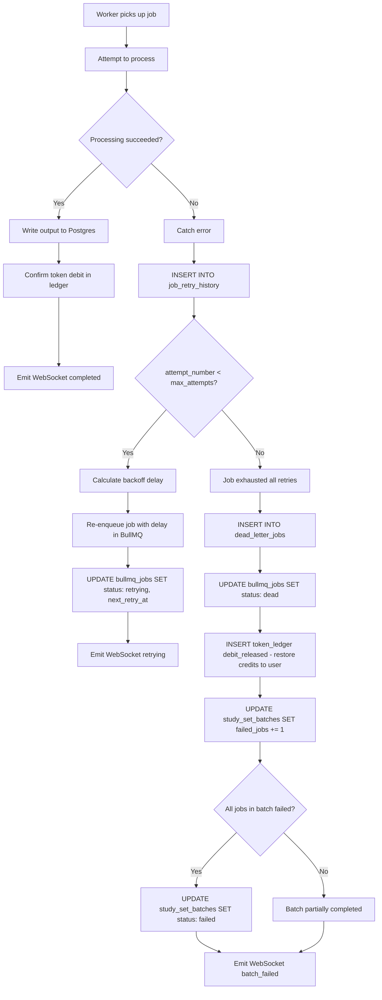
```mermaid
flowchart TD
    A[Worker picks up job] --> B[Attempt to process]
    B --> C{Processing succeeded?}
    C -- Yes --> D[Write output to Postgres]
    D --> E[Confirm token debit in ledger]
    E --> F[Emit WebSocket completed]

    C -- No --> G[Catch error]
    G --> H[INSERT INTO job_retry_history]
    H --> I{attempt_number < max_attempts?}

    I -- Yes --> J[Calculate backoff delay]
    J --> K[Re-enqueue job with delay in BullMQ]
    K --> L[UPDATE bullmq_jobs SET status: retrying, next_retry_at]
    L --> M[Emit WebSocket retrying]

    I -- No --> N[Job exhausted all retries]
    N --> O[INSERT INTO dead_letter_jobs]
    O --> P[UPDATE bullmq_jobs SET status: dead]
    P --> Q[INSERT token_ledger debit_released - restore credits to user]
    Q --> R[UPDATE study_set_batches SET failed_jobs += 1]
    R --> S{All jobs in batch failed?}
    S -- Yes --> T[UPDATE study_set_batches SET status: failed]
    S -- No --> U[Batch partially completed]
    T --> V[Emit WebSocket batch_failed]
    U --> V
```

---

## Group 4: Token Ledger Flows

### 4.1 — Token ledger update after AI job completion

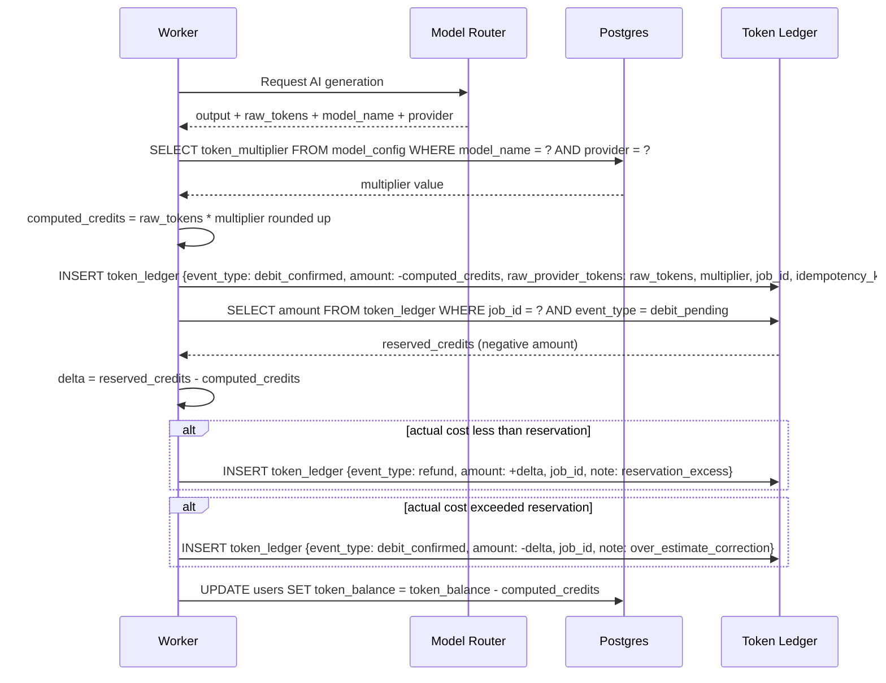
```mermaid
sequenceDiagram
    participant Worker
    participant ModelRouter as Model Router
    participant Postgres
    participant Ledger as Token Ledger

    Worker->>ModelRouter: Request AI generation
    ModelRouter-->>Worker: output + raw_tokens + model_name + provider

    Worker->>Postgres: SELECT token_multiplier FROM model_config WHERE model_name = ? AND provider = ?
    Postgres-->>Worker: multiplier value

    Worker->>Worker: computed_credits = raw_tokens * multiplier rounded up

    Worker->>Ledger: INSERT token_ledger {event_type: debit_confirmed, amount: -computed_credits, raw_provider_tokens: raw_tokens, multiplier, job_id, idempotency_key}

    Worker->>Ledger: SELECT amount FROM token_ledger WHERE job_id = ? AND event_type = debit_pending
    Ledger-->>Worker: reserved_credits (negative amount)

    Worker->>Worker: delta = reserved_credits - computed_credits

    alt actual cost less than reservation
        Worker->>Ledger: INSERT token_ledger {event_type: refund, amount: +delta, job_id, note: reservation_excess}
    end

    alt actual cost exceeded reservation
        Worker->>Ledger: INSERT token_ledger {event_type: debit_confirmed, amount: -delta, job_id, note: over_estimate_correction}
    end

    Worker->>Postgres: UPDATE users SET token_balance = token_balance - computed_credits
```

---

### 4.2 — Monthly credit grant (cron job)

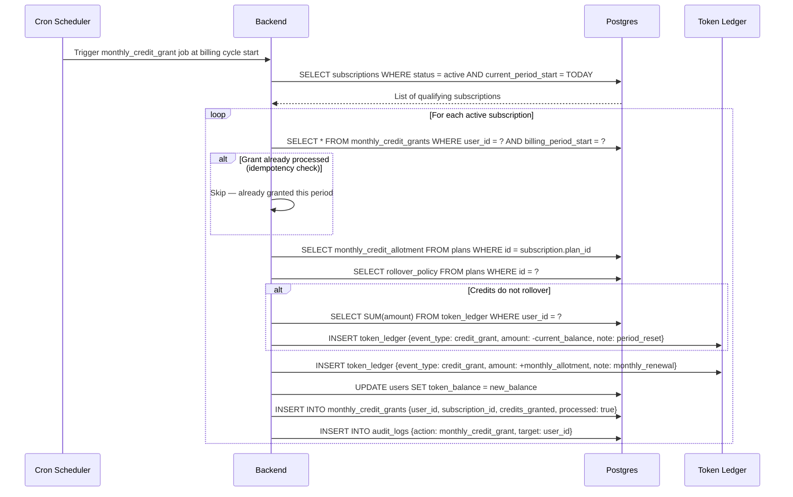
```mermaid
sequenceDiagram
    participant Cron as Cron Scheduler
    participant Backend
    participant Postgres
    participant Ledger as Token Ledger

    Cron->>Backend: Trigger monthly_credit_grant job at billing cycle start

    Backend->>Postgres: SELECT subscriptions WHERE status = active AND current_period_start = TODAY
    Postgres-->>Backend: List of qualifying subscriptions

    loop For each active subscription
        Backend->>Postgres: SELECT * FROM monthly_credit_grants WHERE user_id = ? AND billing_period_start = ?

        alt Grant already processed (idempotency check)
            Backend->>Backend: Skip — already granted this period
        end

        Backend->>Postgres: SELECT monthly_credit_allotment FROM plans WHERE id = subscription.plan_id

        Backend->>Postgres: SELECT rollover_policy FROM plans WHERE id = ?

        alt Credits do not rollover
            Backend->>Postgres: SELECT SUM(amount) FROM token_ledger WHERE user_id = ?
            Backend->>Ledger: INSERT token_ledger {event_type: credit_grant, amount: -current_balance, note: period_reset}
        end

        Backend->>Ledger: INSERT token_ledger {event_type: credit_grant, amount: +monthly_allotment, note: monthly_renewal}
        Backend->>Postgres: UPDATE users SET token_balance = new_balance
        Backend->>Postgres: INSERT INTO monthly_credit_grants {user_id, subscription_id, credits_granted, processed: true}
        Backend->>Postgres: INSERT INTO audit_logs {action: monthly_credit_grant, target: user_id}
    end
```

---

### 4.3 — Token quota check before job creation

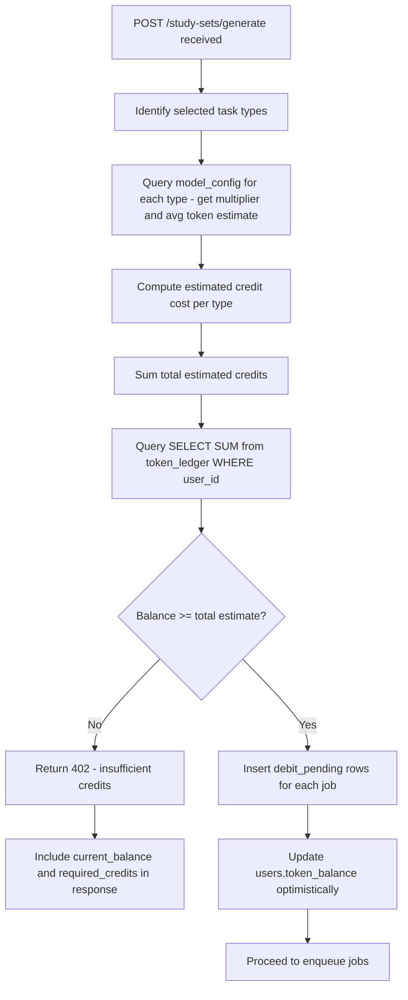
```mermaid
flowchart TD
    A[POST /study-sets/generate received] --> B[Identify selected task types]
    B --> C[Query model_config for each type - get multiplier and avg token estimate]
    C --> D[Compute estimated credit cost per type]
    D --> E[Sum total estimated credits]
    E --> F[Query SELECT SUM from token_ledger WHERE user_id]
    F --> G{Balance >= total estimate?}
    G -- No --> H[Return 402 - insufficient credits]
    H --> I[Include current_balance and required_credits in response]
    G -- Yes --> J[Insert debit_pending rows for each job]
    J --> K[Update users.token_balance optimistically]
    K --> L[Proceed to enqueue jobs]
```

---

## Group 5: Payment & Billing Flows

### 5.1 — Stripe subscription checkout

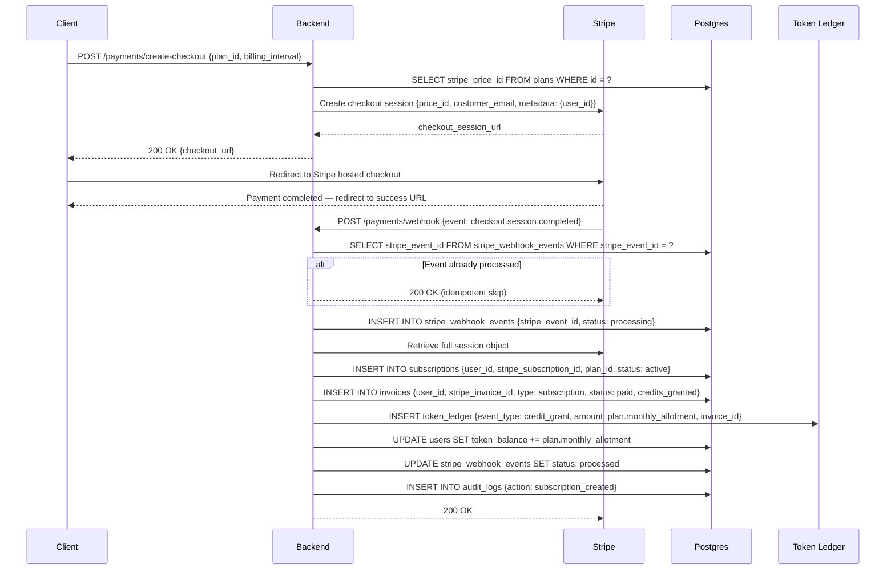
```mermaid
sequenceDiagram
    participant Client
    participant Backend
    participant Stripe
    participant Postgres
    participant Ledger as Token Ledger

    Client->>Backend: POST /payments/create-checkout {plan_id, billing_interval}
    Backend->>Postgres: SELECT stripe_price_id FROM plans WHERE id = ?
    Backend->>Stripe: Create checkout session {price_id, customer_email, metadata: {user_id}}
    Stripe-->>Backend: checkout_session_url

    Backend-->>Client: 200 OK {checkout_url}
    Client->>Stripe: Redirect to Stripe hosted checkout
    Stripe-->>Client: Payment completed — redirect to success URL

    Stripe->>Backend: POST /payments/webhook {event: checkout.session.completed}
    Backend->>Postgres: SELECT stripe_event_id FROM stripe_webhook_events WHERE stripe_event_id = ?

    alt Event already processed
        Backend-->>Stripe: 200 OK (idempotent skip)
    end

    Backend->>Postgres: INSERT INTO stripe_webhook_events {stripe_event_id, status: processing}
    Backend->>Stripe: Retrieve full session object
    Backend->>Postgres: INSERT INTO subscriptions {user_id, stripe_subscription_id, plan_id, status: active}
    Backend->>Postgres: INSERT INTO invoices {user_id, stripe_invoice_id, type: subscription, status: paid, credits_granted}
    Backend->>Ledger: INSERT token_ledger {event_type: credit_grant, amount: plan.monthly_allotment, invoice_id}
    Backend->>Postgres: UPDATE users SET token_balance += plan.monthly_allotment
    Backend->>Postgres: UPDATE stripe_webhook_events SET status: processed
    Backend->>Postgres: INSERT INTO audit_logs {action: subscription_created}
    Backend-->>Stripe: 200 OK
```

---

### 5.2 — Stripe webhook processing (all event types)

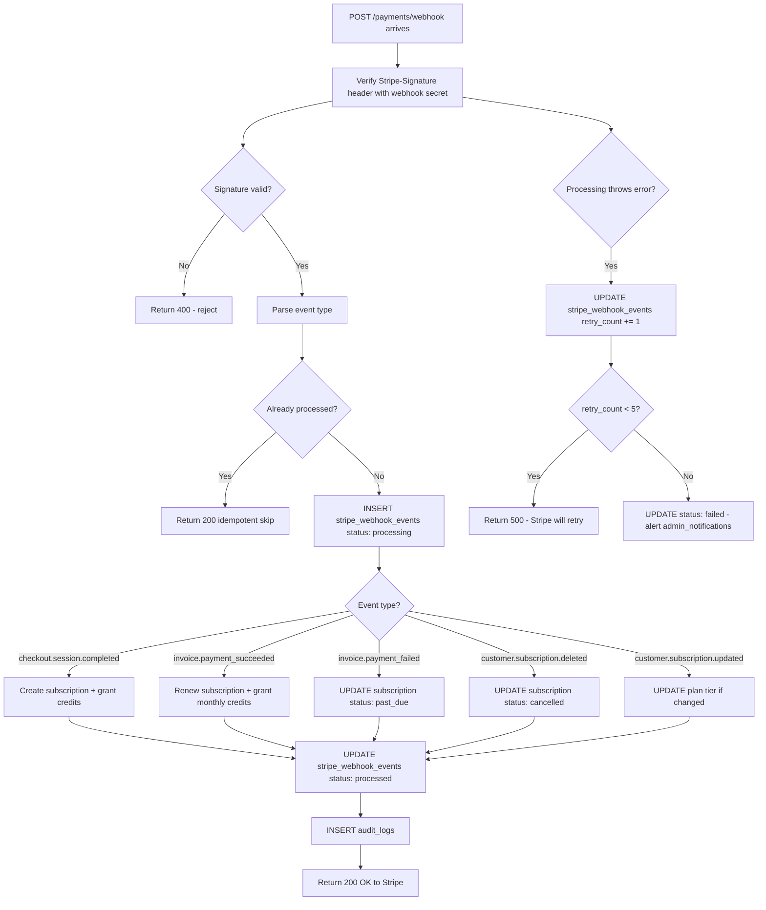
```mermaid
flowchart TD
    A[POST /payments/webhook arrives] --> B[Verify Stripe-Signature header with webhook secret]
    B --> C{Signature valid?}
    C -- No --> D[Return 400 - reject]
    C -- Yes --> E[Parse event type]
    E --> F{Already processed?}
    F -- Yes --> G[Return 200 idempotent skip]
    F -- No --> H[INSERT stripe_webhook_events status: processing]

    H --> I{Event type?}

    I -- checkout.session.completed --> J[Create subscription + grant credits]
    I -- invoice.payment_succeeded --> K[Renew subscription + grant monthly credits]
    I -- invoice.payment_failed --> L[UPDATE subscription status: past_due]
    I -- customer.subscription.deleted --> M[UPDATE subscription status: cancelled]
    I -- customer.subscription.updated --> N[UPDATE plan tier if changed]

    J --> O[UPDATE stripe_webhook_events status: processed]
    K --> O
    L --> O
    M --> O
    N --> O

    O --> P[INSERT audit_logs]
    P --> Q[Return 200 OK to Stripe]

    B --> R{Processing throws error?}
    R -- Yes --> S[UPDATE stripe_webhook_events retry_count += 1]
    S --> T{retry_count < 5?}
    T -- Yes --> U[Return 500 - Stripe will retry]
    T -- No --> V[UPDATE status: failed - alert admin_notifications]
```

---

### 5.3 — One-time credit top-up purchase

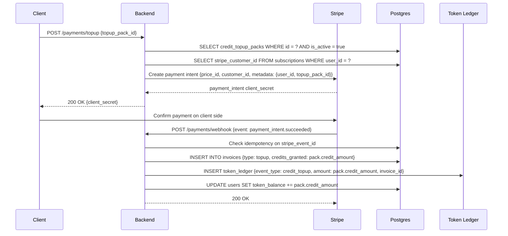
```mermaid
sequenceDiagram
    participant Client
    participant Backend
    participant Stripe
    participant Postgres
    participant Ledger as Token Ledger

    Client->>Backend: POST /payments/topup {topup_pack_id}
    Backend->>Postgres: SELECT credit_topup_packs WHERE id = ? AND is_active = true
    Backend->>Postgres: SELECT stripe_customer_id FROM subscriptions WHERE user_id = ?
    Backend->>Stripe: Create payment intent {price_id, customer_id, metadata: {user_id, topup_pack_id}}
    Stripe-->>Backend: payment_intent client_secret

    Backend-->>Client: 200 OK {client_secret}
    Client->>Stripe: Confirm payment on client side

    Stripe->>Backend: POST /payments/webhook {event: payment_intent.succeeded}
    Backend->>Postgres: Check idempotency on stripe_event_id
    Backend->>Postgres: INSERT INTO invoices {type: topup, credits_granted: pack.credit_amount}
    Backend->>Ledger: INSERT token_ledger {event_type: credit_topup, amount: pack.credit_amount, invoice_id}
    Backend->>Postgres: UPDATE users SET token_balance += pack.credit_amount
    Backend-->>Stripe: 200 OK
```

---

### 5.4 — Subscription cancellation

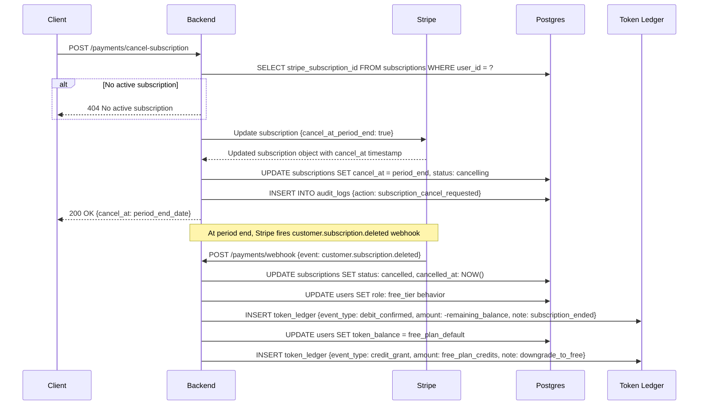
```mermaid
sequenceDiagram
    participant Client
    participant Backend
    participant Stripe
    participant Postgres
    participant Ledger as Token Ledger

    Client->>Backend: POST /payments/cancel-subscription
    Backend->>Postgres: SELECT stripe_subscription_id FROM subscriptions WHERE user_id = ?

    alt No active subscription
        Backend-->>Client: 404 No active subscription
    end

    Backend->>Stripe: Update subscription {cancel_at_period_end: true}
    Stripe-->>Backend: Updated subscription object with cancel_at timestamp

    Backend->>Postgres: UPDATE subscriptions SET cancel_at = period_end, status: cancelling
    Backend->>Postgres: INSERT INTO audit_logs {action: subscription_cancel_requested}
    Backend-->>Client: 200 OK {cancel_at: period_end_date}

    Note over Stripe,Backend: At period end, Stripe fires customer.subscription.deleted webhook

    Stripe->>Backend: POST /payments/webhook {event: customer.subscription.deleted}
    Backend->>Postgres: UPDATE subscriptions SET status: cancelled, cancelled_at: NOW()
    Backend->>Postgres: UPDATE users SET role: free_tier behavior
    Backend->>Ledger: INSERT token_ledger {event_type: debit_confirmed, amount: -remaining_balance, note: subscription_ended}
    Backend->>Postgres: UPDATE users SET token_balance = free_plan_default
    Backend->>Ledger: INSERT token_ledger {event_type: credit_grant, amount: free_plan_credits, note: downgrade_to_free}
```

---

## Group 6: AI Model Router Flows

### 6.1 — Model selection and provider routing

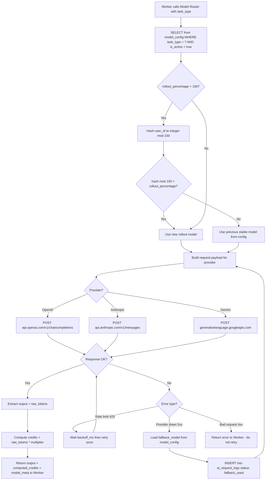
```mermaid
flowchart TD
    A[Worker calls Model Router with task_type] --> B[SELECT from model_config WHERE task_type = ? AND is_active = true]
    B --> C{rollout_percentage < 100?}
    C -- Yes --> D[Hash user_id to integer mod 100]
    D --> E{hash mod 100 < rollout_percentage?}
    E -- No --> F[Use previous stable model from config]
    E -- Yes --> G[Use new rollout model]
    C -- No --> G

    G --> H[Build request payload for provider]
    F --> H

    H --> I{Provider?}
    I -- OpenAI --> J[POST api.openai.com/v1/chat/completions]
    I -- Anthropic --> K[POST api.anthropic.com/v1/messages]
    I -- Gemini --> L[POST generativelanguage.googleapis.com]

    J --> M{Response OK?}
    K --> M
    L --> M

    M -- Yes --> N[Extract output + raw_tokens]
    N --> O[Compute credits = raw_tokens * multiplier]
    O --> P[Return output + computed_credits + model_meta to Worker]

    M -- No --> Q{Error type?}
    Q -- Rate limit 429 --> R[Wait backoff_ms then retry once]
    R --> M
    Q -- Provider down 5xx --> S[Load fallback_model from model_config]
    S --> T[INSERT into ai_request_logs status: fallback_used]
    T --> H
    Q -- Bad request 4xx --> U[Return error to Worker - do not retry]
```

---

### 6.2 — Model rolling upgrade procedure

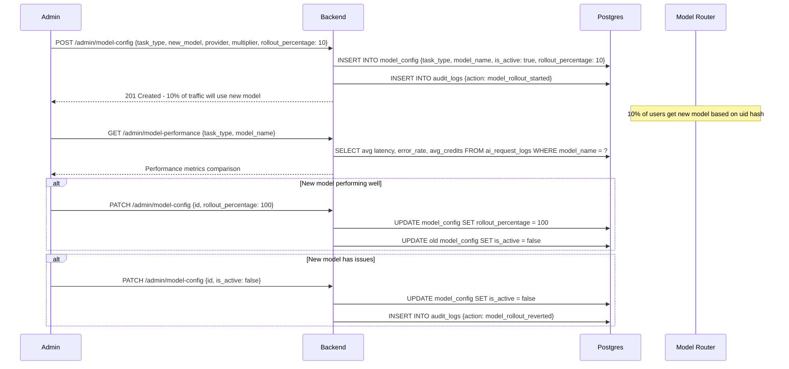
```mermaid
sequenceDiagram
    participant Admin
    participant Backend
    participant Postgres
    participant ModelRouter as Model Router

    Admin->>Backend: POST /admin/model-config {task_type, new_model, provider, multiplier, rollout_percentage: 10}
    Backend->>Postgres: INSERT INTO model_config {task_type, model_name, is_active: true, rollout_percentage: 10}
    Backend->>Postgres: INSERT INTO audit_logs {action: model_rollout_started}
    Backend-->>Admin: 201 Created - 10% of traffic will use new model

    Note over ModelRouter: 10% of users get new model based on uid hash

    Admin->>Backend: GET /admin/model-performance {task_type, model_name}
    Backend->>Postgres: SELECT avg latency, error_rate, avg_credits FROM ai_request_logs WHERE model_name = ?
    Backend-->>Admin: Performance metrics comparison

    alt New model performing well
        Admin->>Backend: PATCH /admin/model-config {id, rollout_percentage: 100}
        Backend->>Postgres: UPDATE model_config SET rollout_percentage = 100
        Backend->>Postgres: UPDATE old model_config SET is_active = false
    end

    alt New model has issues
        Admin->>Backend: PATCH /admin/model-config {id, is_active: false}
        Backend->>Postgres: UPDATE model_config SET is_active = false
        Backend->>Postgres: INSERT INTO audit_logs {action: model_rollout_reverted}
    end
```

---

## Group 7: RAG Architecture Flows

### 7.1 — Vector search during generation

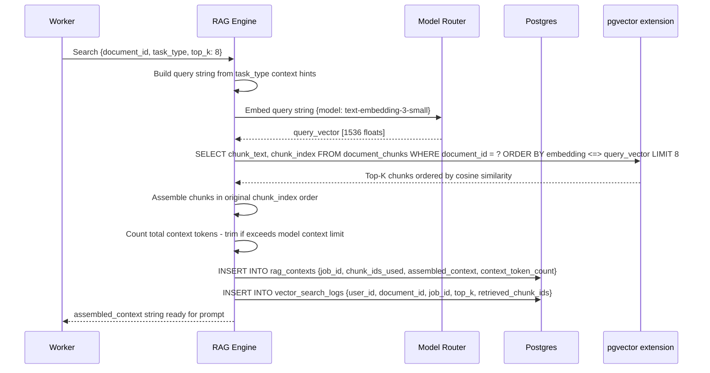
```mermaid
sequenceDiagram
    participant Worker
    participant RAGEngine as RAG Engine
    participant ModelRouter as Model Router
    participant Postgres
    participant pgvector as pgvector extension

    Worker->>RAGEngine: Search {document_id, task_type, top_k: 8}
    RAGEngine->>RAGEngine: Build query string from task_type context hints
    RAGEngine->>ModelRouter: Embed query string {model: text-embedding-3-small}
    ModelRouter-->>RAGEngine: query_vector [1536 floats]

    RAGEngine->>pgvector: SELECT chunk_text, chunk_index FROM document_chunks WHERE document_id = ? ORDER BY embedding <=> query_vector LIMIT 8

    pgvector-->>RAGEngine: Top-K chunks ordered by cosine similarity

    RAGEngine->>RAGEngine: Assemble chunks in original chunk_index order
    RAGEngine->>RAGEngine: Count total context tokens - trim if exceeds model context limit

    RAGEngine->>Postgres: INSERT INTO rag_contexts {job_id, chunk_ids_used, assembled_context, context_token_count}
    RAGEngine->>Postgres: INSERT INTO vector_search_logs {user_id, document_id, job_id, top_k, retrieved_chunk_ids}

    RAGEngine-->>Worker: assembled_context string ready for prompt
```

---

### 7.2 — Re-embedding on document update

```mermaid
flowchart TD
    A[Document text updated or replaced] --> B[Compute new content hash]
    B --> C{Content hash changed?}

    C -- No --> D[No action needed]

    C -- Yes --> E[Update document record set hash text and status pending]
    E --> F[Delete existing document chunks]
    F --> G[Delete output cache for old hash]
    G --> H[Delete RAG contexts for document]
    H --> I[Insert embedding job with queued status]
    I --> J[Enqueue job on embedding queue]
    J --> K[Run chunking and embedding pipeline]
    K --> L[Insert new document chunks with vectors]
    L --> M[Update document status to ready]
```

---

## Group 8: Paper Grader Flows

### 8.1 — Paper grader submission and result generation

```mermaid
sequenceDiagram
    participant Client
    participant Backend
    participant R2 as Cloudflare R2
    participant Postgres
    participant BullMQ
    participant GraderWorker as Grader Worker
    participant ModelRouter as Model Router

    Client->>Backend: POST /grader/submit {rubric_file, assignment_file}
    Backend->>Backend: Virus scan both files
    Backend->>R2: PUT grader/{user_id}/{submission_id}/rubric.pdf
    Backend->>R2: PUT grader/{user_id}/{submission_id}/assignment.pdf
    Backend->>Backend: Extract text from both PDFs

    Backend->>Postgres: Check token quota for grader task
    Backend->>Postgres: INSERT INTO token_ledger {event_type: debit_pending}
    Backend->>Postgres: INSERT INTO bullmq_jobs {queue: studley:grader, task_type: grader}
    Backend->>BullMQ: Enqueue grader job {rubric_text, assignment_text, submission_id, job_id}
    Backend-->>Client: 202 Accepted {submission_id}

    BullMQ->>GraderWorker: Dequeue job
    GraderWorker->>Postgres: SELECT prompt_templates WHERE task_type = grader AND is_active = true
    GraderWorker->>ModelRouter: Generate {rubric_text + assignment_text + prompt_template}
    ModelRouter-->>GraderWorker: structured JSON {criteria_scores, overall_grade, feedback, missing_requirements}

    GraderWorker->>Postgres: INSERT INTO study_set_outputs {type: grader, output_data: JSON result}
    GraderWorker->>Postgres: INSERT INTO ai_request_logs
    GraderWorker->>Postgres: INSERT INTO token_ledger {event_type: debit_confirmed}
    GraderWorker->>Postgres: UPDATE bullmq_jobs SET status: completed
    GraderWorker->>Client: WebSocket emit {submission_id, status: completed, output_id}

    Client->>Backend: GET /grader/result/{output_id}
    Backend->>Postgres: SELECT output_data FROM study_set_outputs WHERE id = ?
    Backend-->>Client: 200 OK {criteria_scores, overall_grade, feedback, improvement_areas}
```

---

## Group 9: Browser Extension Flows

### 9.1 — Extension authentication and session sharing

```mermaid
sequenceDiagram
    participant Extension
    participant FirebaseAuth as Firebase Auth
    participant Backend
    participant Postgres

    Extension->>FirebaseAuth: Sign in with stored credentials or OAuth popup
    FirebaseAuth-->>Extension: JWT token

    Extension->>Backend: POST /auth/session {jwt, device_type: extension}
    Backend->>Backend: Verify JWT
    Backend->>Postgres: SELECT user + plan + token_balance
    Backend->>Postgres: INSERT INTO user_sessions {device_type: browser_extension}
    Backend-->>Extension: 200 OK {token_balance, plan, session_id}

    Extension->>Extension: Store session_id in chrome.storage.local
    Note over Extension: Token is attached to every subsequent API call
```

---

### 9.2 — Exam assist question answering

```mermaid
sequenceDiagram
    participant Student
    participant Extension
    participant Backend
    participant QuotaGuard as Token Quota Guard
    participant ModelRouter as Model Router
    participant Ledger as Token Ledger

    Student->>Extension: Click assist button on exam question
    Extension->>Extension: Extract question text from DOM or OCR screenshot
    Extension->>Extension: Debounce 500ms to prevent spam

    Extension->>Backend: POST /solve {question_text, context_type: exam}
    Backend->>QuotaGuard: Check balance >= solve_task_min_cost

    alt Insufficient balance
        Backend-->>Extension: 402 Insufficient credits - show top-up prompt
    end

    Backend->>Postgres: INSERT token_ledger {event_type: debit_pending}
    Backend->>ModelRouter: Generate {task_type: solve, question: question_text}
    ModelRouter-->>Backend: answer + explanation + raw_tokens

    Backend->>Postgres: INSERT INTO ai_request_logs
    Backend->>Ledger: INSERT debit_confirmed {computed_credits}
    Backend->>Ledger: INSERT refund if applicable
    Backend->>Postgres: UPDATE users.token_balance

    Backend-->>Extension: 200 OK {answer, explanation, credits_used}
    Extension->>Student: Display answer overlay next to question
```

---

## Group 10: Administration Flows

### 10.1 — Admin manual credit adjustment

```mermaid
sequenceDiagram
    participant Admin
    participant Backend
    participant Postgres
    participant Ledger as Token Ledger

    Admin->>Backend: POST /admin/credits/adjust {user_id, amount, reason}
    Backend->>Backend: Verify req.user.role == admin
    Backend->>Postgres: SELECT users WHERE id = ? AND is_active = true

    alt User not found
        Backend-->>Admin: 404 User not found
    end

    Backend->>Ledger: INSERT token_ledger {event_type: admin_adjustment, amount: signed_amount, note: reason}
    Backend->>Postgres: UPDATE users SET token_balance += amount
    Backend->>Postgres: INSERT INTO audit_logs {actor_id: admin_id, action: credit_adjustment, target_type: user, target_id: user_id, before_state: {balance}, after_state: {new_balance}}
    Backend-->>Admin: 200 OK {new_balance}
```

---

### 10.2 — Content moderation and user flag flow

```mermaid
flowchart TD
    A[Admin reviews flagged content] --> B[GET /admin/flags - list open user_flags]
    B --> C[Admin selects a flag to review]
    C --> D[GET /admin/documents/document_id - view document content]
    D --> E{Admin decision?}

    E -- Content is fine --> F[PATCH /admin/flags/id status: dismissed]
    F --> G[INSERT audit_logs action: flag_dismissed]

    E -- Content violates policy --> H[DELETE document from Postgres and R2]
    H --> I[INSERT content_moderation_logs result: removed]
    I --> J{First offense?}
    J -- Yes --> K[Send warning to user via notification]
    J -- No --> L{Repeated offense?}
    L -- Yes --> M[UPDATE users SET is_active = false]
    M --> N[Invalidate all user sessions in Postgres]
    N --> O[INSERT audit_logs action: user_suspended]
    L -- No --> K
    K --> P[UPDATE user_flags SET status: resolved]
    O --> P
    P --> Q[INSERT audit_logs action: content_removed]
```

---

### 10.3 — Worker health monitoring

```mermaid
sequenceDiagram
    participant Worker
    participant Postgres
    participant Redis
    participant AdminPanel as Admin Panel

    loop Every 30 seconds
        Worker->>Postgres: UPSERT worker_health {worker_name, host, pid, status: healthy, last_heartbeat_at: NOW(), jobs_processed_total, avg_processing_time_ms}
        Worker->>Redis: SET worker_heartbeat:{worker_name} TTL 60s
    end

    AdminPanel->>Backend: GET /admin/workers
    Backend->>Postgres: SELECT * FROM worker_health WHERE last_heartbeat_at > NOW() - 90s
    Backend->>Postgres: SELECT * FROM worker_health WHERE last_heartbeat_at < NOW() - 90s
    Backend-->>AdminPanel: {active_workers, stale_workers}

    Note over Worker,Redis: If heartbeat stops - Redis key expires after 60s

    Redis->>Backend: Keyspace notification - worker key expired
    Backend->>Postgres: UPDATE worker_health SET status: unresponsive WHERE worker_name = ?
    Backend->>Postgres: INSERT INTO admin_notifications {type: worker_down, title: Worker unresponsive}
    Backend->>AdminPanel: WebSocket emit {alert: worker_down, worker_name}
```

---

### 10.4 — Feature flag evaluation

```mermaid
flowchart TD
    A[Request hits feature-gated route] --> B[Extract user_id + plan_tier from req.user]
    B --> C[SELECT feature_flags WHERE key = feature_name]
    C --> D{is_enabled_globally?}
    D -- Yes --> E[Allow access]
    D -- No --> F{user_id in enabled_for_user_ids array?}
    F -- Yes --> E
    F -- No --> G{plan_tier in enabled_for_plan_tiers array?}
    G -- Yes --> E
    G -- No --> H{rollout_percentage > 0?}
    H -- No --> I[Return 403 Feature not available]
    H -- Yes --> J[Hash user_id mod 100]
    J --> K{hash < rollout_percentage?}
    K -- Yes --> E
    K -- No --> I
    E --> L[Proceed with request]
```

---

## Group 11: Real-time Progress Flow

### 11.1 — WebSocket/SSE progress updates to client

```mermaid
sequenceDiagram
    participant Client
    participant Backend
    participant Redis
    participant Worker

    Client->>Backend: GET /study-sets/batch/{batch_id}/stream (SSE connection)
    Backend->>Backend: Verify JWT and ownership of batch_id
    Backend->>Redis: SUBSCRIBE channel:batch:{batch_id}
    Backend-->>Client: SSE connection established

    loop For each job completing
        Worker->>Redis: PUBLISH channel:batch:{batch_id} {job_id, type, status, output_id}
        Redis-->>Backend: Message received
        Backend-->>Client: SSE data: {job_id, type, status, output_id}
        Client->>Client: Update UI card for that study set type
    end

    Note over Worker,Client: When all jobs complete or batch fails

    Worker->>Redis: PUBLISH channel:batch:{batch_id} {status: batch_complete}
    Redis-->>Backend: Final message
    Backend-->>Client: SSE data: {status: batch_complete}
    Backend->>Backend: Close SSE connection
    Backend->>Redis: UNSUBSCRIBE channel:batch:{batch_id}
```

---

## Group 12: Output Retrieval Flow

### 12.1 — Fetching a completed study set

```mermaid
sequenceDiagram
    participant Client
    participant Backend
    participant Postgres
    participant R2 as Cloudflare R2

    Client->>Backend: GET /study-sets/output/{output_id}
    Backend->>Postgres: SELECT study_set_outputs WHERE id = ? AND user_id = ?

    alt Not found or not owned by user
        Backend-->>Client: 404 Not found
    end

    alt Status is not completed
        Backend-->>Client: 409 Not ready yet - include current status
    end

    alt Output type is podcast
        Backend->>R2: Generate signed URL for r2_path with TTL 1 hour
        R2-->>Backend: Signed URL
        Backend-->>Client: 200 OK {type: podcast, signed_audio_url, expires_in: 3600}
    end

    alt Output type is any other type
        Backend-->>Client: 200 OK {type, output_data: JSONB}
    end

    Backend->>Postgres: UPDATE usage_stats for tracking
```

---