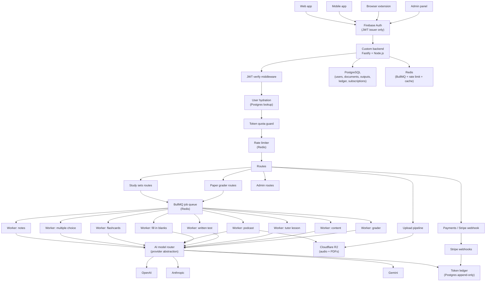
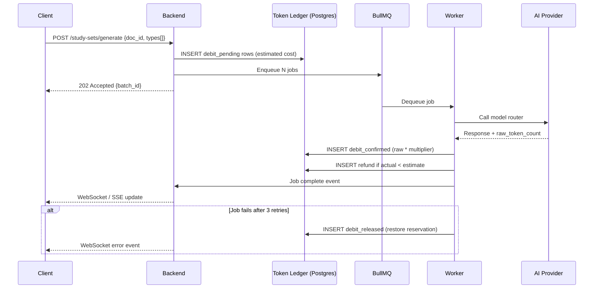
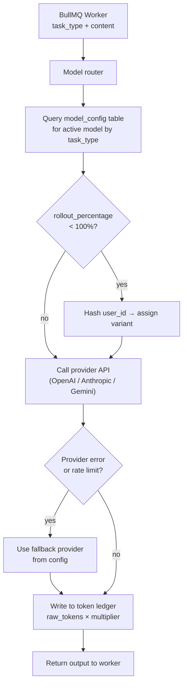

# Technical Overview

Epics: Requirements Analysis (../Dwh%20Project/Requirements%20Analysis%20db2379c3555d8281b6fb812fbb973e16.md)
Status: Yes

# Full System Requirements Analysis

## Tech stack (confirmed)

- Auth: Firebase Auth (JWT issuance only)
- Backend: Custom Node.js/Fastify server — owns all business logic, role enforcement, token ledger
- Database: PostgreSQL
- File storage: Cloudflare R2
- Job queue: BullMQ (with Redis)
- Payment: Stripe
- AI: Multiple providers (OpenAI, Anthropic, Gemini, etc.) behind a model router
- Clients: Web app, Mobile app (current), Browser extension

---

## 1. Authentication & session architecture

Firebase Auth is responsible for one thing only: issuing a signed JWT after the user logs in via email/password or Google SSO. After that, Firebase is no longer in the picture.

Every client — web, mobile, extension — attaches the Firebase JWT as a Bearer token on every request to the custom backend. The backend's JWT middleware verifies the token signature against Firebase's public keys, extracts the `uid` and any custom claims, then looks up the user's full profile (role, subscription tier, token balance) from PostgreSQL. This means Firebase never sees the business data and the backend is the single source of truth for what a user is allowed to do.

Role enforcement happens entirely in the backend middleware. The roles table in PostgreSQL maps `firebase_uid` to a role (`student`, `admin`). When an admin is created or demoted,  update PostgreSQL —  do not need Firebase custom claims for this since the backend controls the lookup.

---

## 2. Custom backend structure

The backend is a Fastify (or Express) server with the following middleware chain that every request passes through in order:

**Step 1 — JWT verification middleware:** Checks the Authorization header, verifies the Firebase JWT, and attaches `req.user = { uid, email }` to the request context.

**Step 2 — User hydration middleware:** Takes the `uid`, queries PostgreSQL for the user's role, subscription tier, and current token balance. Attaches this to `req.user`. If the user doesn't exist in Postgres yet (first login), creates the record.

**Step 3 — Token quota guard:** Before any route that triggers an AI call, this middleware checks whether the user has sufficient token balance in the ledger. If not, it returns a 402 with a clear message. This guard is applied selectively per route, not globally.

**Step 4 — Rate limiter:** Per-user per-minute request caps using Redis. Prevents abuse from the browser extension's button-spam scenario and from API-level scripting.

Route groups after middleware:

- `/api/study-sets` — all study set creation, listing, fetching
- `/api/grader` — paper grader submission and result retrieval
- `/api/upload` — file upload intake with virus scan hook
- `/api/payments` — Stripe webhook receiver and subscription status
- `/api/admin` — admin-only routes behind an additional role check middleware
- `/api/token-ledger` — internal-only, called by workers after AI completions

---

## 3. Content input & upload pipeline

A student can provide content in two ways: upload a PDF, or paste raw text directly.

**PDF path:** The file is sent to the backend upload route. Before anything else, the file goes through a virus scan step (ClamAV or a cloud scanning API). If it passes, the raw PDF is stored in Cloudflare R2 under a path like `uploads/{user_id}/{document_id}.pdf`. the backend then runs text extraction (using `pdfjs-dist` or `pdf-parse` in Node) to pull out plain text. The extracted text is stored in PostgreSQL in a `documents` table alongside metadata (filename, upload time, page count, character count). The R2 path is stored as a reference. The original PDF is kept in R2 for display purposes. The extracted text is what gets sent to AI workers.

**Plain text path:** The text is accepted directly in the request body, sanitized, and stored in the `documents` table. No R2 storage needed for this path.

In both cases, the document gets a `document_id` UUID and a `content_hash` (SHA-256 of the text). The content hash is used later for AI output caching — if the same document is submitted again with a different study set selection, previously generated sets can be retrieved from cache without re-running AI.

---

## 4. Study set generation — the 8 types

From image 2, the 8 study set types visible under the sidebar are: Notes, Multiple Choice, Flashcards, Podcast, Fill in the Blanks, Written Test, Tutor Lesson, and Content.

After the student uploads or pastes content, the UI presents these 8 options as toggles. The student selects which ones they want generated. They can select any subset — even all 8.

When they confirm, the backend receives one request with `document_id` and an array of selected types like `["notes", "flashcards", "podcast"]`. The backend does the following synchronously before responding: validates the request, checks token quota for the total estimated cost of all selected types, reserves those tokens in the ledger (marked as `pending`), stores a `study_set_batch` record in PostgreSQL with status `processing`, and returns a `batch_id` to the client immediately with a 202 Accepted response.

All actual AI generation is asynchronous. The client polls a status endpoint or listens via WebSocket/SSE for progress updates.

---

## 5. BullMQ job queue — detailed design

BullMQ runs on Redis. For each batch, the backend enqueues one job per selected study set type. These jobs run concurrently across separate worker processes.

**Queue names and their worker behavior:**

`studley:notes` — The worker receives the document text and prompts the AI to produce structured, hierarchical notes with headings and bullet points. Output is stored as JSON in PostgreSQL in the `study_set_outputs` table.

`studley:multiple-choice` — The worker generates a configurable number of MCQ questions (default 10), each with 4 options and a correct answer flag. Output is stored as a JSON array of question objects.

`studley:flashcards` — Generates term/definition pairs. Output stored as a JSON array. The worker also hashes each generated question and checks for duplicates against the user's history for that document, filtering repeats before storing.

`studley:podcast` — This is the most complex worker. It first generates a conversational script from the document content (two-voice dialogue format works well). Then it calls a TTS API (e.g. OpenAI TTS or ElevenLabs) to synthesize the audio. The audio file is uploaded to Cloudflare R2 under `podcasts/{user_id}/{output_id}.mp3`. The R2 URL is stored in the output record. The PostgreSQL row for this output points to the R2 path rather than storing content inline.

`studley:fill-in-blanks` — Generates cloze-style sentences where key terms are blanked out. Output stored as JSON.

`studley:written-test` — Generates open-ended essay-style questions based on the material. Output stored as JSON.

`studley:tutor-lesson` — Generates a structured lesson plan with explanation sections, worked examples, and comprehension check questions. Output stored as JSON.

`studley:content` — Generates a clean, readable rewrite or summary of the source content formatted for studying. Output stored as JSON or markdown.

**Job lifecycle:** Each job starts with status `queued`, transitions to `processing` when a worker picks it up, and ends as either `completed` or `failed`. On completion, the worker writes the output to PostgreSQL, updates the `study_set_outputs` row with status `completed`, calls the token ledger API to finalize the token deduction (converting `pending` to `consumed`), and emits a WebSocket event so the client can refresh that specific study set card in real time.

On failure, the job is retried up to 3 times with exponential backoff. After 3 failures, the token reservation for that job is released back to the user's balance, the output row is marked `failed`, and the client is notified.

---

## 6. AI model router — multi-provider with rolling upgrades

This is one of the most important architectural pieces given the requirement for consistent token counting across providers.

The model router is a service layer inside the backend (or a separate microservice) that abstracts away which AI provider and model version is actually being called. Workers never call OpenAI or Anthropic directly — they call the model router with a request like:

```
{
  task: "flashcards",
  content: "...",
  user_id: "...",
  max_tokens: 1200
}
```

The router maintains a **model configuration table** in PostgreSQL with the following columns: `task_type`, `provider`, `model_name`, `model_version`, `token_multiplier`, `is_active`, `rolled_out_at`. This is how rolling upgrades work — when a new model releases,  insert a new row with `is_active = false`, test it, then flip it to active.  can also do percentage rollouts by adding a `rollout_percentage` column and using the user's `uid` hash to deterministically assign them to a variant.

**The token multiplier is the key to consistent counting.** Different models have different tokenizers and different costs. Rather than storing raw provider tokens (which are meaningless across providers),  define a normalized internal unit called a **Studley credit**. Each model config row has a `token_multiplier` — for example, GPT-4o might be `1.0` (the baseline), Claude Sonnet might be `0.9`, Gemini Flash might be `0.4`. When the router gets a response back from the provider with the raw token count, it multiplies by the model's factor to compute the credit cost, and sends that to the token ledger. The student always sees credits, never raw tokens, and the cost remains comparable regardless of which model served them.

The router also handles fallback: if the primary provider returns an error or rate-limit, it falls back to the secondary provider defined in the config, logs the fallback event, and uses that model's multiplier for billing.

---

## 7. Token ledger — full design

The token ledger is an append-only table in PostgreSQL. It is never updated in place — every event is a new row. This is intentional: it gives  a complete audit trail and makes the balance computable at any point in time by summing the rows.

**Table: `token_ledger`**

| column | type | description |
| --- | --- | --- |
| `id` | UUID PK | row identifier |
| `user_id` | UUID FK | references users table |
| `event_type` | enum | `credit`, `debit_pending`, `debit_confirmed`, `debit_released`, `refund` |
| `amount` | integer | positive for credits, negative for debits |
| `job_id` | UUID nullable | links to the BullMQ job that caused the debit |
| `task_type` | varchar | e.g. `flashcards`, `podcast` |
| `model_name` | varchar | which model was used |
| `provider` | varchar | which provider |
| `raw_tokens` | integer | what the provider reported |
| `multiplier` | decimal | the factor applied |
| `created_at` | timestamptz | always server-side, never client |

**Flow for a generation request:**

1. User submits batch → backend computes estimated credit cost per job type → inserts `debit_pending` rows (negative amounts) for each job → user's spendable balance decreases immediately.
2. Worker completes → worker reports actual token usage → backend inserts a `debit_confirmed` row with the real cost → if real cost < estimate, inserts a small `refund` row for the difference.
3. Worker fails after 3 retries → backend inserts a `debit_released` row (positive amount equal to the reservation) → balance restored.

**Computing balance:** `SELECT SUM(amount) FROM token_ledger WHERE user_id = $1`. This is the live balance. For performance,  can maintain a denormalized `users.token_balance` integer that is updated transactionally alongside each ledger insert. The ledger remains the source of truth; the denormalized field is just a fast read cache.

**Credit top-ups from Stripe:** When Stripe fires a `checkout.session.completed` or `invoice.payment_succeeded` webhook, the backend inserts a `credit` row into the ledger with the appropriate amount based on the plan purchased. Subscription plans map to monthly credit allotments. One-time top-up packs map to a fixed credit amount. All of this is driven by a `stripe_products` config table in PostgreSQL that maps `stripe_price_id` to `credit_amount`.

---

## 8. Paper grader

The paper grader is a separate feature from study sets. The flow is:

The teacher uploads a grading rubric (PDF or text). The student uploads their completed assignment (PDF or text). Both are stored in R2 and extracted as text. A single AI job is enqueued to `studley:grader`. The worker sends the rubric and the assignment together in a structured prompt, asking the AI to score each rubric criterion, provide section-level feedback, and highlight missing requirements. The output is a structured JSON object with scores per criterion, an overall grade, strengths, and improvement areas. This is stored in PostgreSQL and displayed to the student in a formatted results view.

---

## 9. Stripe & subscription management

Stripe is integrated via webhooks only on the backend —  never trust client-side Stripe events.

 maintain a `subscriptions` table in PostgreSQL: `user_id`, `stripe_customer_id`, `stripe_subscription_id`, `plan` (free/pro), `status` (active/past_due/cancelled), `current_period_end`, `monthly_credit_allotment`.

On the first day of each billing period, a scheduled cron job (or Stripe's `invoice.payment_succeeded` webhook) inserts the monthly credit allotment as a `credit` row in the token ledger and resets any unused credits based on the rollover policy (rollover or expire — the choice).

Free plan users get a fixed monthly credit allocation. Pro plan users get a larger allocation plus the ability to buy top-up packs.

---

## 10. PostgreSQL schema — key tables

The core tables  need:

`users` — uid (firebase), email, role, subscription_id, token_balance (denormalized), created_at

`documents` — id, user_id, filename, content_hash, extracted_text, r2_path, page_count, created_at

`study_set_batches` — id, user_id, document_id, selected_types (jsonb array), status, created_at

`study_set_outputs` — id, batch_id, type, status, output_data (jsonb), r2_path (nullable, for podcast audio), model_name, token_cost, created_at

`token_ledger` — as described in section 7

`model_config` — task_type, provider, model_name, token_multiplier, rollout_percentage, is_active

`subscriptions` — user_id, stripe_customer_id, plan, status, current_period_end

`audit_log` — actor_id, action, target_type, target_id, payload (jsonb), created_at

---

## 11. Mermaid diagrams

Here is the overall system architecture:



Here is the token ledger flow specifically:



Here is the model router and rolling upgrade flow:

